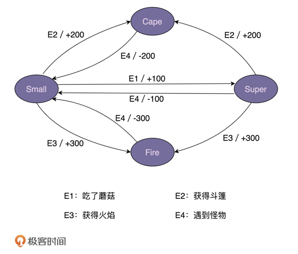
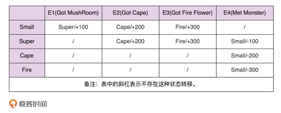

## 概述 

状态模式（State），容许一个对象在其内部状态改变时，改变他的行为（当然不改变他的行为，只做状态的转换，也是可以的）。

有限状态机，英文翻译是 Finite State Machine，缩写为 FSM，简称为状态机。
状态机有 3 个组成部分：状态（State）、事件（Event）、动作（Action）。
其中，事件也称为转移条件（Transition Condition）。
事件触发状态的转移及动作的执行。不过，动作不是必须的，也可能只转移状态，不执行任何动作。


一定长度上可以简化 if/else 分支带来的麻烦。


## 示例说明

### 1. example1
模拟观看电影时不同状态的切换 <br/>
观看电影时通常有如下状态: <br/>
1. 正常播放状态 <br/>
2. 倍速播放状态 <br/>
3. 暂停状态 <br/>
4. 停止状态 <br/>

eg1_1 在每个具体状态类下的操作 <br/>

```
/**
 * description:  暂停播放
 * createTime: 2019-07-30 20:09
 * @author zqy
 */
public class PauseState extends VideoState{

    @Override
    void play(VideoContext videoContext) {
        videoContext.setVideoState(VideoContext.PLAY_STATE);
        videoContext.play(); // 具体在该状态下的操作
    }

    @Override
    void speed(VideoContext videoContext) {
        videoContext.setVideoState(VideoContext.SPEED_STATE);
        videoContext.speed();
    }

    @Override
    void pause(VideoContext videoContext) {
        System.out.println("暂停播放视频");
    }

    @Override
    void stop(VideoContext videoContext) {
        videoContext.setVideoState(VideoContext.STOP_STATE);
        videoContext.stop();
    }
}
```
    
eg1_2 在eg1_1的基础上，简化一下操作 todo <br/>


eg1_3 让 VideoState 持有 VideoContext 的引用 <br/>


### 2. example2 
模拟程序员一天中不同状态的切换 <br/>
工作时通常有如下状态: <br/>
1. 上午状态 <br/>
2. 中午状态 <br/>
3. 下午状态 <br/>
4. 傍晚状态 <br/>
5. 加班状态 <br/>
6. 猝死状态 <br/>

(注：该代码有执行顺序的要求，仅做示例)


### 3. example3 

[参考](https://time.geekbang.org/column/article/218375?utm_source=pinpaizhuanqu&utm_medium=geektime&utm_campaign=guanwang&utm_term=guanwang&utm_content=0511)

#### 场景
“超级马里奥”游戏。
在游戏中，马里奥可以变身为多种形态，
比如小马里奥（Small Mario）、超级马里奥（Super Mario）、
火焰马里奥（Fire Mario）、斗篷马里奥（Cape Mario）等等。
在不同的游戏情节下，各个形态会互相转化，并相应的增减积分。
比如，初始形态是小马里奥，吃了蘑菇之后就会变成超级马里奥，并且增加 100 积分。


实际上，马里奥形态的转变就是一个状态机。
其中，马里奥的不同形态就是状态机中的“状态”，
游戏情节（比如吃了蘑菇）就是状态机中的“事件”，
加减积分就是状态机中的“动作”。
比如，吃蘑菇这个事件，会触发状态的转移：从小马里奥转移到超级马里奥，
以及触发动作的执行（增加 100 积分）。



- 状态机实现方式一：分支逻辑法
- 状态机实现方式二：查表法



- 状态机实现方式三：状态模式


## 博客地址 
https://www.jianshu.com/p/1eab2f039b10


